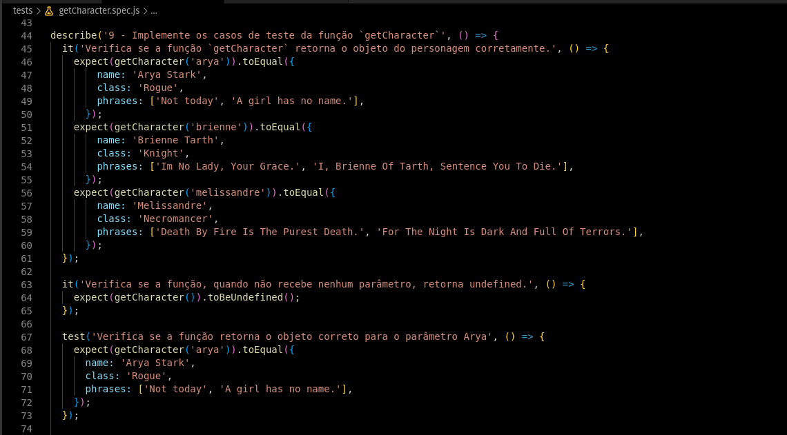

<!-- Introdução -->
<h1 align="center"> Projeto JS Unit Tests  - :five: </h1>

<!-- Descrição -->
<p align="center">
Este é meu quinto projeto desenvolvido em minha jornada de aprendizado como desenvolvedor na Trybe,
nele desenvolvi diversos testes unitários utilizando o _Jest_ afim de aplicar e demonstrar o Desenvolvimento voltado para testes(TDD).
</p>

#
<!-- Habilidades -->
<h2 align="center"> Habilidades Desenvolvidas: </h2>

* Utilizei o framework _Jest_ para construir testes capazes de garantir as funcionálidades de uma aplicação. :heavy_check_mark:
* Desenvolvi _Testes Unitários_ capazes de avaliar a integridade do código, contemplando diversas funções. :heavy_check_mark:
* Apliquei _Test Driven Dvelopment_ para conferir maior segurança ao meu código. :heavy_check_mark:

#
<!-- Preview -->
<h2 align="center"> Preview: </h2>

<div align="center">
    
</div>

#
<!-- Ferramentas utilizadas -->
<details align="center">
  <summary>
	  <h2>Ferramentas e Tecnologias utilizadas:</h2>
	</summary>

  <div align="center">

  | Linguagens              | Frameworks              |
  | :---------------------- | :---------------------- |
  | JavaScript              | Jest                    |
  | .                       | .                       |

  </div>

</details>

#
<!-- Instalação e utilização -->
<details align="center">
  <summary>
    <h2>Como instalar e utilizar o projeto:</h2>
  </summary>

<details>
  <summary>
    <h3>Especificações Tecnicas:</h3>
  </summary>

  <div align="left">
  
  * Git - <i> `git -v` informará a versão em uso.</i>
  * NPM V8+ - <i> `npm -v` informará a versão em uso.</i>
  * NodeJS V16+ - <i> `node -v` informará a versão em uso.</i>

  </div>

  #

  </details>

  <div align="left">
    
  1. Faça a clonagem do projeto - <i>Será necessário instalar dependências</i>
  ```shell
  git clone git@github.com:luanfgoncalves/project-js-unit-test.git
  ```
  2. instale as dependencias na Raiz do projeto - <i>Não execute `audit fix`</i>
  ```shell
  npm install
  ```
  3. Os testes desenvolvidos podem ser executados atrvés do comando `npm test` - <i>Deve ser executado na raíz do projeto</i>
   
  </div>

</details>

#
<!-- Meu contato -->
<h2 align="center"> Connect with me: </h2>

<div align="center">
  <a href="https://instagram.com/luanfgoncalves" target="_blank"></a>
  <a href = "mailto:luanfgoncalves@outlook.com"></a>
  <a href="https://www.linkedin.com/in/luanfgoncalves/" target="_blank"></a> 
</div>
